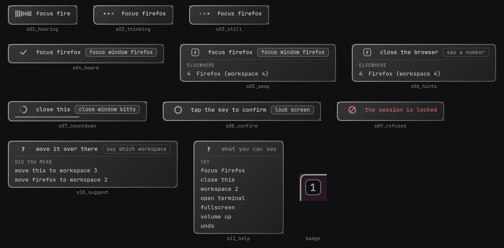

# hyprsay

Voice control for [Hyprland](https://hypr.land). Hold a key, say what you want, let go.

```
"workspace three"              "bring up my notes"          "close this"
"open the file manager"        "put the music on five"      "make it a bit bigger"
"focus the browser"            "scroll down"                "volume down"
"open chrome and go to youtube.com"        "search youtube for linus tech tips"
```

It acts; it does not talk back. A small overlay shows what it heard and what it did, in your
compositor's own border colors, and never takes focus or eats a click.



## Status: alpha

Built and verified on one machine (Arch, Hyprland 0.56.2). What that means precisely:

| Verified | Not yet verified |
|---|---|
| 2652 unit tests; lint clean | A human voice through a real microphone, end to end |
| 348 live evaluations, 91 percent correct, no wrong action in any of the 27 hostile-window attacks | `bind` and `bindr` from a real config, rather than injected key events |
| Real guarded dispatch to the compositor over its socket | The global-shortcuts push-to-talk transport |
| Recorded audio to a correct decision, through the real recognizer | Hyprland's Lua config provider: detected and reported, its dispatch strings never run |
| Engine and overlay running live: overlay maps while listening, focus untouched, clean shutdown | Multi-monitor and fractional scaling |

## How it works

Three speeds, fastest first. Most commands never touch the network.

1. **Grammar** (about 1 ms). "workspace three", "close this", "open firefox": a table of patterns
   over a live lexicon of your windows and installed apps. It repairs what speech recognizers
   really produce ("Switch to Workspace 3.", "workspace too", "fire fox").
2. **Jev** (about 380 ms). When you paraphrase ("bring up my notes") or describe instead of
   naming ("the music"), the sentence goes to [Jev](https://vercel.com/ai-gateway/models/jev),
   a model that does not generate text: it answers typed questions with probabilities. hyprsay
   asks several small questions at once (which action, which of *your* open windows, which
   installed app) and only ever lets it choose among candidates built from your real desktop.
3. **Hints** (no network). When two windows fit equally, nobody can know which you meant. For a
   focus it takes the most recently used one and shows numbered badges, so saying "two" switches.
   For anything less reversible it shows the badges and waits.

You can chain commands. "Open firefox and move it to workspace three" is split by code at the
"and", and Jev only answers whether that "and" really separates two commands, so "type hello and
goodbye" stays one piece of dictation. A chain stops at the first clause that does not act and
tells you which one.

Inside an application it can scroll, page, switch tabs, open a URL, search, and find text. Those
never come from the model: each one is an exact phrase in the grammar. Clicking a control by name
also works, but only for applications that publish an accessibility tree.

Speech recognition is local by default ([Parakeet 110M](https://huggingface.co/nvidia/parakeet-tdt_ctc-110m)
through [sherpa-onnx](https://github.com/k2-fsa/sherpa-onnx)). If the local transcript leads
nowhere, the same clip is sent once to a cloud speech model, which is more robust to bad audio.

### Measured, not promised

All from the development machine (i5-8350U, no GPU). Raw data is in `docs/research/live/`.

| | |
|---|---|
| Grammar decision | 1 ms median |
| Local recognition of a one-second command | 93 ms idle; about 165 ms while a test suite is running |
| Jev round trip, from Europe | about 315 ms median, tail to 1 s and beyond |
| Fastest cloud speech model through the gateway | 452 ms (Gemini 3.5 transcribe: 3.2 s; Whisper: 1.2 s) |
| Your window animations | often the largest delay of all: 500 ms or more on a default-ish config |

Jev is not deterministic, whatever the marketing says: thirty identical requests on a near-tie
flipped their answer four times. hyprsay therefore never acts on a thin margin, asks two
independent formulations of the window question and requires them to agree, and keeps every
decision that matters in code.

## Safety

Voice is an unauthenticated channel: anyone in the room, or a video, can speak. So:

| Tier | Examples | What it takes |
|---|---|---|
| 0 | focus, switch workspace | acts at once; ties offer a numbered swap |
| 1 | launch, move, resize, float, fullscreen, volume | acts only when the target is anchored by a trusted field; ties ask |
| 2 | close a window, type text | the verb said literally, an explicit target, then a cancellable countdown. Press the key again to cancel |
| 3 | lock the screen | grammar only, and a physical tap of the key to confirm. Never offered to the model |

A window title can never authorize anything. Titles are written by whoever owns the window, a
hostile web page included, so a target has to be corroborated against a system `.desktop` file or
one of your own aliases. The same goes for the name of a button: it can raise what an action
costs, never lower it.

Typing comes only from "type ..." in the grammar. The model cannot ask for it. It is refused in
terminals, launchers and password dialogs, pinned to the window that had focus when the key went
down, and stripped of every control character rather than just Enter.

Nothing runs while the session is locked. The microphone closes and the buffer is zeroed, and
because Hyprland does not gate its own IPC on the lock, hyprsay checks it again between every
step. Every write goes through hypruse's guarded functions, against fresh state, to an exact
window address.

## Privacy

By default no window title leaves your machine, dictated text never leaves it at all, and
common commands send nothing. [`docs/PRIVACY.md`](docs/PRIVACY.md) lists exactly what is sent
and when, and `hyprsay inspect` prints the real request bodies of your last command. Two lines
of config make it fully local.

## Install

Needs Hyprland, Python 3.11+, [uv](https://docs.astral.sh/uv/), and from your distribution:
`python-gobject`, `gtk4-layer-shell`, `portaudio`, and for volume and media `wireplumber` and
`playerctl`. For Jev you need a [Vercel AI Gateway](https://vercel.com/ai-gateway) key.

```sh
git clone <this repository> && cd hyprsay
uv sync
install -d -m 700 ~/.config/hyprsay
install -m 600 /dev/null ~/.config/hyprsay/ai-gateway.key   # then paste your key into it
uv run hyprsay setup        # speech model (about 130 MB), default config, your bind lines
uv run hyprsay doctor       # what works, what is missing
```

Then try it without changing anything permanent:

```sh
uv run hyprsay try      # temporary key binding, engine and overlay. Ctrl-C puts it all back
```

Hold `SUPER` and the key just above Tab (`` ` `` on a US keyboard, `²` on AZERTY), say
"workspace three", let go. It binds that key by position, so the layout does not matter.
When you want it always
running, add the two lines `hyprsay binds` prints to your Hyprland config and install the
services:

```sh
uv run hyprsay setup --units    # installs and starts the systemd user units
```

## Try it without a microphone

```sh
uv run hyprsay say "put the browser on workspace three"   # dry run against your live desktop
uv run hyprsay say "volume down" --act                    # carry it out
uv run hyprsay replay clip.wav                            # start from recorded audio
uv run hyprsay record clip.wav                            # record one
uv run hyprsay inspect                                    # what was heard, decided, sent
```

## Configuration

`~/.config/hyprsay/config.toml`. Every key is optional, and an unknown key is an error rather
than silently ignored.

```toml
[stt]
backend = "hybrid"          # "local": audio never leaves.  "cloud": always use the gateway
cloud_model = "fish-audio/transcribe-1"

[privacy]
titles = "when_needed"      # or "never"

[safety]
type_allow_classes = ["obsidian"]   # apps where dictation needs no countdown

[aliases]
browser = "firefox"
```

## Development

```sh
uv run ruff check . && uv run python -m pytest tests     # what CI runs
uv run python evals/run.py --offline                     # 116 labelled cases, no network
uv run python evals/run.py --reps 3                      # against live Jev
```

The evaluation keeps the wrong-action rate apart from merely asking when it could have
acted. Those are different failures, and for the hostile-title cases the only acceptable value
is zero. [`docs/PLAN.md`](docs/PLAN.md) is the plan of record, with every figure labelled as
measured, verified, documented or assumed; [`docs/research/`](docs/research/) holds the research
and says how far each report can be trusted.

## Credits

hyprsay is a fork of [hypruse](https://github.com/IlyasKhallouki/hypruse) and stands on its
Hyprland control core and its trust guards ([its README](docs/hypruse-README.md)). Speech
recognition by [sherpa-onnx](https://github.com/k2-fsa/sherpa-onnx); the default model is
NVIDIA's Parakeet TDT 110M, licensed CC-BY-4.0. Decisions by TypeSafe AI's Jev through the
Vercel AI Gateway. MIT licensed.
